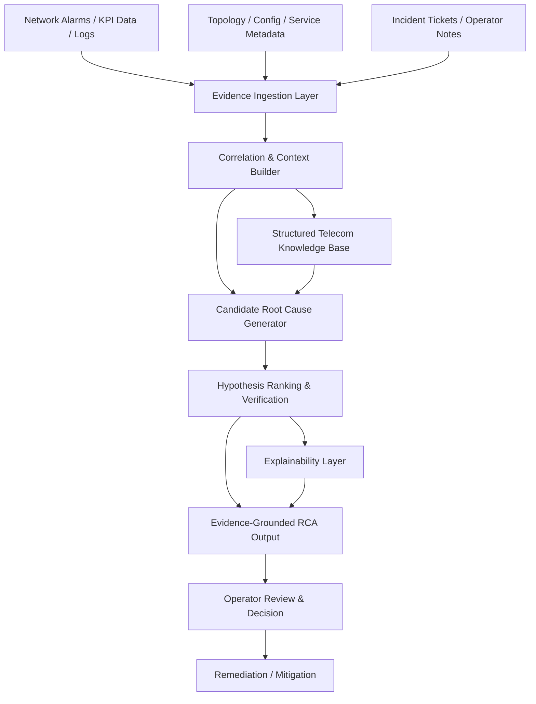
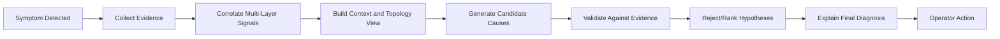

# Large Language Models (LLMs) for Telecom Root Cause Analysis (RCA): A Structured Reasoning Framework for Evidence-Grounded Diagnosis

**Authors:** Hao Zhou, Mandar Kulkarni, Hao Chen, Yan Xin, and Charlie (Jianzong) Zhang, Fellow, IEEE

---

## Abstract

Root-cause analysis (RCA) is a critical task in telecom network operations, but diagnosing performance degradation in modern 5G and emerging 6G networks remains challenging due to complex cross-layer dependencies and large-scale, heterogeneous system behavior. Traditional telecom RCA has relied on rule-based expert systems, alarms, and KPIs, while more recently, ML techniques have been introduced to detect anomalies and identify potential causes. However, the complexity of modern telecom systems often makes purely rule- or model-based approaches insufficient. Large language models (LLMs) offer a promising alternative because they can integrate domain knowledge, exploit structured signals, and support reasoning across multimodal evidence.

This paper first reviews the evolution of telecom RCA from rule-based and machine-learning approaches to modern LLM-driven methods. It highlights the strengths and limitations of current techniques, emphasizing that naive use of LLMs often leads to hallucination or weak evidence grounding. The work proposes a structured reasoning framework for LLM-enabled telecom RCA that aligns diagnostic reasoning with telecom-specific evidence, network topology, fault patterns, and operational context.

The central argument is that LLMs can be valuable for RCA only when paired with evidence-grounded, structured reasoning pipelines. Such an approach can improve diagnostic accuracy, interpretability, and trust while preserving the operational realities of telecom networks.

---

## Introduction

With the deployment of 5G and the emergence of 6G, telecom systems are evolving into highly complex and large-scale infrastructures. These networks integrate heterogeneous components across radio, transport, core, and service layers, and they support highly dynamic traffic and service demands. As a result, network failures and service degradations can lead to significant operational consequences.

Examples include degradation in radio access, core transport disruptions, and service outages affecting enterprise, consumer, and critical infrastructure. Traditional RCA methods, while useful in constrained environments, struggle to keep pace with the increasing complexity and variability of contemporary telecom systems.

This challenge has motivated the adoption of richer data sources and more expressive diagnostic techniques. In particular, LLMs are increasingly being studied for telecom use cases because they can reason over large amounts of unstructured and semi-structured information, including alarms, logs, incident descriptions, and operational knowledge.

---

## Why LLMs for Telecom RCA?

LLMs offer several attractive capabilities for telecom RCA:

- They can process natural-language incident descriptions and documentation.
- They can reason across multiple sources of evidence, including alarms, traces, and topology information.
- They can encode general domain knowledge and provide explanations for complex failures.
- They can support human-in-the-loop decision support and troubleshooting workflows.

However, in telecom operations, these capabilities are not automatically sufficient. A model that simply generates plausible explanations may still be unreliable if it lacks grounding in observed evidence, system constraints, and causal structure.

---

## Key Challenges

The paper identifies several concerns that limit the direct use of LLMs in telecom RCA:

1. **Hallucination**: LLMs may provide confident but incorrect root-cause hypotheses.
2. **Lack of evidence grounding**: Explanations may not match the actual telemetry or network behavior.
3. **Complexity of network dependencies**: Faults often span multiple layers and domains, including radio, transport, and core functions.
4. **Sparse and heterogeneous data**: Operator data may be inconsistent, partial, or difficult to correlate.
5. **Interpretability and trust**: For network operators, the diagnostic process needs to be explainable and auditable.

These limitations motivate a more structured and disciplined approach to LLM use in RCA.

---

## Proposed Direction: Structured Reasoning for Evidence-Grounded Diagnosis

The paper argues that telecom RCA should not rely on free-form LLM reasoning alone. Instead, it should combine the strengths of LLMs with explicit reasoning frameworks grounded in evidence.

A structured RCA pipeline would typically include:

- identifying the symptom and affected service area,
- gathering relevant telemetry, alarms, and topology data,
- correlating facts across layers and time windows,
- generating candidate root causes based on domain priors,
- validating hypotheses against evidence,
- producing explanations that are traceable to observed network conditions.

This approach is more aligned with operator expectations and reduces the likelihood of unsupported conclusions.

---

## Design Details of the LLM-Enabled RCA Framework

The core design proposed in the paper is not a single monolithic LLM prompt but a structured diagnostic system that separates observation, evidence aggregation, hypothesis generation, and verification. The framework is built to reflect how telecom operators actually investigate network faults.

### 1. Input Layer

The system begins by ingesting multiple telemetry and incident sources, including:

- alarm and event streams,
- performance counters and KPIs,
- logs from network elements,
- configuration and topology metadata,
- service-impact descriptions,
- and operator notes or incident tickets.

These inputs are heterogeneous, so the first design requirement is to normalize them into a common evidence representation before diagnosis begins.

### 2. Evidence Collection and Correlation

A diagnosis engine must correlate events across time and network layers. For example, a radio problem may appear as a KPI degradation, but the actual cause may be a transport issue, a configuration drift, or a core network anomaly. Therefore, the framework explicitly emphasizes multi-layer correlation rather than isolated symptom analysis.

Design-wise, this means the system should:

- map symptoms to relevant network entities,
- align timestamps across telemetry sources,
- identify affected cells, regions, services, and subscribers,
- and connect abnormal behavior to likely causal domains.

### 3. Structured Knowledge Representation

The design treats telecom knowledge as structured operational context, not just free-form text. This includes:

- topology information,
- fault dependency information,
- historical incident patterns,
- domain rules and heuristics,
- and service impact semantics.

This helps the LLM reason within a realistic operational model instead of guessing from vague signals.

### 4. Hypothesis Generation

Once evidence is assembled, the model generates multiple candidate root causes rather than making a single unsupported assertion. These hypotheses are conditioned on:

- observed symptoms,
- network context,
- historical fault patterns,
- and physical/logical dependencies.

This component is important because RCA in telecom networks is often ambiguous, and the goal is to reason over alternatives instead of jumping to the first plausible explanation.

### 5. Evidence-Grounded Verification

A central design principle of the paper is that each candidate cause must be validated against evidence. The LLM is not simply asked to produce an answer; it is guided to check whether the hypothesis matches the observed alarms, metrics, topology, and service impact. This creates a feedback loop in which candidate diagnoses are scored or ranked based on supporting evidence.

In practice, the verification step may include:

- confirming temporal alignment,
- checking whether the suspected layer is consistent with KPI trends,
- comparing with historical incidents,
- and identifying contradictions in the available evidence.

### 6. Explainable Output

The final design element is explainability. The system should provide not only the root cause but also:

- what evidence supported the diagnosis,
- what alternative hypotheses were considered,
- which signals contradicted other possibilities,
- and why the final conclusion is the most plausible.

This is critical in telecom operations, where operators must trust and audit the diagnosis before acting.

### 7. Human-in-the-Loop Control

The architecture is designed for operational use, not autonomous decision-making alone. Human operators remain in the loop to confirm assumptions, review evidence, and apply business or safety constraints. The LLM acts as an assistant that accelerates analysis and organizes evidence, while the human remains responsible for final action.

### Summary of the Design

In short, the paper’s design is a structured RCA pipeline with four core characteristics:

1. multistream evidence ingestion,
2. cross-layer correlation and context modeling,
3. evidence-grounded hypothesis testing,
4. explainable, operator-facing decision support.

This is the main architectural difference between a naive LLM chatbot and a useful telecom RCA system.

### System Architecture Diagram



### Reasoning Flow Diagram



### Design Interpretation

These diagrams emphasize that the proposed LLM-enabled RCA system is conceptually a pipeline rather than a single chatbot prompt. The emphasis is on evidence grounding, structured reasoning, and operator trust.

---

## Repository Structure

The current workspace is intentionally small and contains the source document and the generated summary. The actual repository tree is:

```text
LLM-enabled-RCA-for-RAN/
├── .git/
├── README.md
├── AI:ML or LLM RCA.pdf
├── AI-ML-or-LLM-RCA.md
└── LICENSE
```

This is a minimal repo structure. In a fuller implementation, the project would typically grow into a modular system such as:

```text
LLM-enabled-RCA-for-RAN/
├── README.md
├── LICENSE
├── data/
│   ├── raw/
│   ├── processed/
│   └── labels/
├── src/
│   ├── ingestion/
│   ├── correlation/
│   ├── retrieval/
│   ├── prompts/
│   ├── reasoning/
│   ├── validation/
│   └── api/
├── models/
│   └── llm-config/
├── notebooks/
│   └── experiments.ipynb
├── docs/
│   ├── architecture.md
│   └── rca-workflow.md
├── tests/
│   └── test_rca_pipeline.py
├── scripts/
│   └── run_pipeline.sh
└── requirements.txt
```

This tree clarifies that a real LLM-based RCA solution is not just a single document or a standalone prompt; it is a project that organizes data ingestion, evidence retrieval, reasoning logic, validation, and operational outputs.

---

## Full LLM-Based RCA Approach

The complete approach for LLM-assisted telecom RCA can be described as a multi-stage reasoning architecture.

### 1. Problem Definition and Scope

The system begins by defining the symptom and affected context, such as:

- cell or region impact,
- service degradation level,
- time window of the incident,
- customer or subscriber impact,
- and operational severity.

This scope ensures that the model does not reason over the entire network without focus.

### 2. Data Acquisition and Ingestion

The next step is to collect all relevant evidence from telecom systems. This includes:

- KPI and performance counters,
- alarm correlations,
- topology and configuration metadata,
- logs and traces,
- historical incident tickets,
- and domain knowledge documents.

The design must normalize these signals into a structured format before the LLM sees them.

### 3. Retrieval and Evidence Selection

Instead of passing all raw data into the model, a practical system retrieves the most relevant facts. This can be done through:

- rule-based filtering,
- vector retrieval over historical incidents and docs,
- attribute-based lookup by cell, site, or service,
- and time-windowed telemetry selection.

This stage reduces noise and focuses the model on signal that matters to the active problem.

### 4. Context Construction for the LLM

The retrieved evidence is assembled into a context package that includes:

- service symptoms,
- impacted network entities,
- trend summaries,
- alarm descriptions,
- topology relationships,
- and historical incidents.

This is the key step that turns raw telemetry into a reasoning-ready artifact for the LLM.

### 5. Candidate Cause Generation

The LLM is then prompted to enumerate plausible root causes under domain constraints. It should produce multiple hypotheses rather than a single speculative answer. The model is guided to reason about:

- physical layer causes,
- transport bottlenecks,
- configuration drift,
- resource exhaustion,
- and service-specific dependencies.

### 6. Evidence-Grounded Evaluation

Each candidate cause is evaluated against the observed evidence. The model checks whether the explanation fits:

- timing consistency,
- correlated KPI degradation,
- alarm causality,
- network topology dependencies,
- and historical patterns.

This step is crucial because the paper’s central message is that LLMs must not be trusted as free-form oracle predictors; they must be anchored in evidence.

### 7. Ranking and Final Diagnosis

After evaluation, the system ranks the plausible causes by confidence and support. The output should include:

- the most likely root cause,
- secondary plausible alternatives,
- supporting evidence,
- conflicting evidence,
- and reasoning trace.

### 8. Human Review and Remediation

Finally, the output is presented to a telecom operator for review. The human can validate the diagnosis, adjust the assumptions, and decide on remediation. This closes the loop between automated reasoning and operational action.

### 9. Feedback Loop for Improvement

The system should also learn from operator feedback. When a diagnosis is confirmed or corrected, that result can be used to update:

- historical RCA examples,
- retrieval indexes,
- prompting templates,
- and model guidance for future incidents.

This creates a continuous improvement cycle for the RCA system.

### Overall Philosophy

The full LLM-based RCA approach is therefore not simply asking an LLM “what is the root cause?” It is an end-to-end architecture that includes:

- structured data collection,
- targeted evidence retrieval,
- context-aware reasoning,
- causal validation,
- explainable output,
- and human decision support.

This is the complete design perspective behind the paper’s claim that LLMs can improve telecom RCA only when embedded in a disciplined, evidence-grounded framework.

---

## Practical Relevance

The paper emphasizes that RCA in modern networks is not simply a classification problem. It is a decision process that depends on complex interactions among:

- radio conditions,
- mobility patterns,
- resource scheduling,
- network configuration,
- service quality indicators,
- and cross-domain system behavior.

Because of this, LLMs may be useful as a reasoning assistant rather than as a standalone diagnosis engine. Their value is strongest when used to synthesize evidence, summarize findings, and support structured investigation.

---

## Conclusion

The article positions LLMs as a promising addition to telecom RCA, but only when used within a disciplined framework that emphasizes evidence, structured reasoning, and operational realism. The paper’s core message is that reliable RCA in next-generation telecom networks requires not just powerful language models, but also principled reasoning grounded in the data and behavior of the network itself.

This is a strong foundation for future research in AI-assisted network operations, particularly in the areas of automated fault diagnosis, explainability, and trustworthy deployment of LLMs in telecom environments.

---

## Notes

This document is a Markdown summary based on the attached PDF titled "Large Language Models (LLMs) for Telecom Root Cause Analysis (RCA): A Structured Reasoning Framework for Evidence-Grounded Diagnosis." It captures the paper’s title, abstract, design logic, and the core arguments visible in the provided excerpt.
