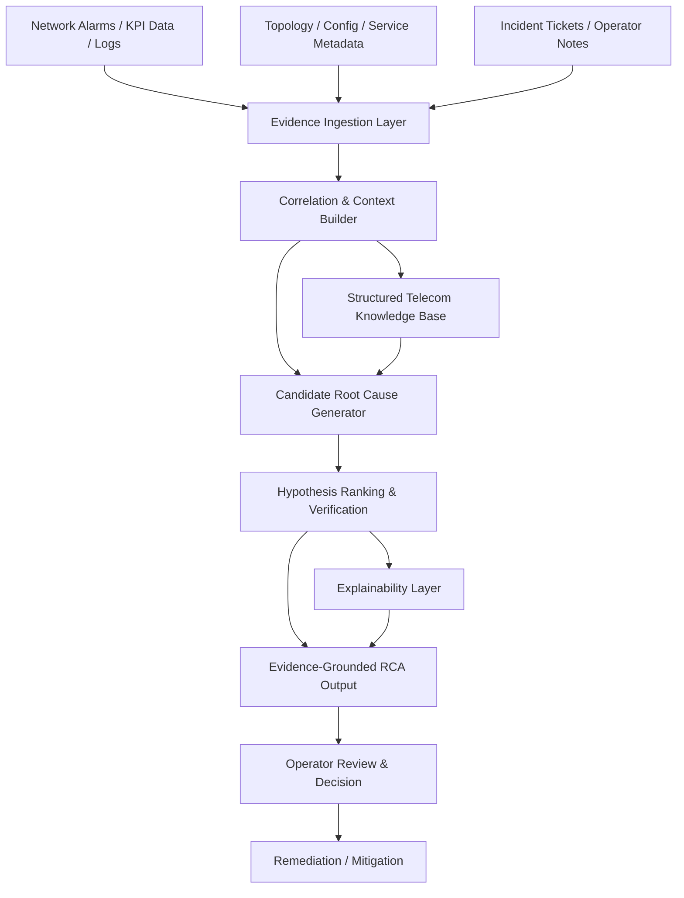
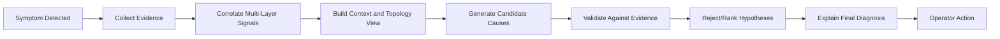
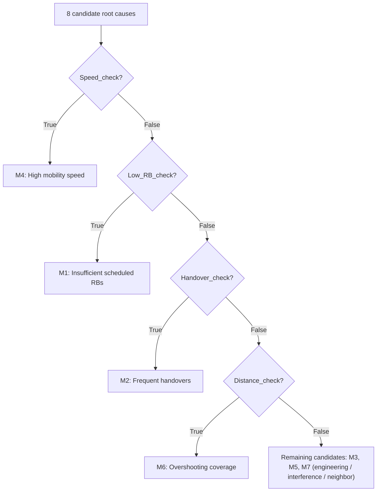

# Large Language Models (LLMs) for Telecom Root Cause Analysis (RCA): A Structured Reasoning Framework for Evidence-Grounded Diagnosis

*This work has been accepted by IEEE Wireless Communications Magazine.*

**Authors:** Hao Zhou, Mandar Kulkarni, Hao Chen, Yan Xin, and Charlie (Jianzhong) Zhang, Fellow, IEEE — Samsung Research America

**Index Terms:** Large language models (LLMs), root cause analysis (RCA), telecom networks, structured reasoning.

---

## Abstract

Root cause analysis (RCA) is a critical task in telecom network operations, but diagnosing performance degradations in modern 5G and emerging 6G networks remains challenging due to complex cross-layer dependencies. While large language models (LLMs) offer promising capabilities for reasoning and knowledge integration, directly applying vanilla LLMs to telecom RCA often leads to hallucination, unstable reasoning, and poor alignment with structured network evidence.

This work first reviews the evolution of telecom RCA from rule-based and machine learning (ML) approaches to emerging LLM-enabled techniques, and provides an overview of recent paradigms, including structured reasoning, retrieval-augmented knowledge grounding, agentic orchestration, and verifiable reasoning. Building upon these insights, the paper proposes a **structured reasoning framework for LLM-enabled telecom RCA** that aligns diagnostic reasoning with telecom-specific evidence and domain knowledge. The proposed approach first organizes heterogeneous network telemetry into canonical contexts, then enforces decision-path reasoning during diagnosis, and finally generates evidence-grounded explanations for reliable fault identification.

Experimental results on two 5G RCA datasets, **TeleLogs** and **TelecomTS**, demonstrate that the proposed framework — named **SEKA-FT** (Structured Evidence- and Knowledge-Aligned Fine-Tuning) — consistently improves diagnostic accuracy and decision consistency compared with baseline techniques. These cross-dataset results highlight the importance of structured reasoning design for practical LLM-based RCA systems in next-generation telecom networks.

---

## 1. Introduction and Motivation

With the deployment of 5G-Advanced and the emerging 6G networks, telecom systems are evolving into highly complex and large-scale infrastructures. These networks integrate heterogeneous components across radio, transport, and core layers, making reliable operation increasingly challenging. As a result, network failures and service degradations may lead to significant operational consequences.

Real-world incidents illustrate the stakes: the **Rogers outage in Canada (2022)**, the **AT&T outage in the United States (2024)**, and the **Optus outage in Australia (2023)** disrupted connectivity for over **100 million devices**, blocked more than **25,000 emergency calls**, and caused nationwide disruptions to payment systems, transportation networks, and healthcare services, with more than **$100 million** in losses.

Traditionally, telecom RCA has relied on **rule-based expert systems** and, more recently, **ML techniques**. Early RCA solutions rely on predefined alarm patterns or KPI thresholds to trigger corresponding troubleshooting procedures. To improve scalability, data-driven ML models have been introduced to detect and classify potential faults. These approaches can process large volumes of telemetry data, but they primarily perform statistical pattern recognition rather than explicit diagnostic reasoning. As a result, ML-based RCA systems often struggle to adapt to unseen failure modes without extensive retraining.

### 1.1 Why LLMs Are Useful for Telecom RCA

Recently, large language models (LLMs) have been successfully applied across many fields and offer promising opportunities for telecom, e.g., knowledge understanding, power control, traffic prediction, and network management. LLMs have several critical advantages over traditional rule-based and ML approaches for telecom RCA:

1. **Strong reasoning capabilities that enable multi-step diagnostic analysis.** Unlike rule engines that follow predefined logic and ML models that primarily learn statistical correlations, LLMs can perform step-by-step reasoning across multiple system indicators to infer potential root causes.
2. **Cross-domain knowledge integration.** LLMs can integrate knowledge across heterogeneous domains, e.g., radio access, transport, and core networks — reasoning that is difficult for traditional methods that typically operate on isolated feature sets.
3. **Human-readable explanations of the diagnostic process.** This capability improves interpretability of RCA outcomes and helps network engineers understand how specific evidence leads to a particular diagnosis.

### 1.2 Key Challenges

Despite these advantages, directly applying vanilla LLMs to telecom RCA remains challenging:

1. **Unstable reasoning.** Telecom RCA often requires systematic verification of multiple diagnostic factors, such as mobility behavior, resource scheduling, and coverage geometry. Vanilla LLMs may produce inconsistent reasoning paths when interpreting similar sets of network measurements.
2. **Heterogeneous, structured evidence across layers.** Telecom RCA involves heterogeneous and structured evidence from multiple system layers. Without explicit mechanisms to align structured telemetry with diagnostic reasoning, LLMs may rely on superficial correlations rather than causal relationships between network events and performance degradations.
3. **Hallucination.** Incorrect conclusions may arise when the model speculates about potential causes without grounding its reasoning in concrete indicators such as KPIs, topology relationships, or configuration parameters.
4. **Complexity of network dependencies.** Faults often span multiple layers and domains (radio, transport, core), making isolated symptom analysis unreliable.
5. **Sparse and heterogeneous data.** Operator data may be inconsistent, partial, or difficult to correlate across sources.
6. **Interpretability and trust.** For network operators, the diagnostic process needs to be explainable and auditable before any remediation action is taken.

These limitations motivate a more structured and disciplined approach to LLM use in RCA — one that moves away from treating RCA as a simple "input-to-label" prediction task.

---

## 2. RCA: From Rule-Based and ML to LLMs

The evolution of RCA can be viewed as a shift from deterministic rule matching, to statistical label prediction, and further toward evidence-grounded reasoning.

- **Rule-based expert systems** provide transparent and deterministic behavior, but rely on predefined alarm patterns, KPI thresholds, and manually maintained troubleshooting logic. As network scenarios become more diverse, such static rules are difficult to scale and update.
- **Data-driven ML methods** improve scalability by learning statistical patterns from historical telemetry. They can detect anomalies, classify faults, and rank possible root causes from large volumes of KPIs, alarms, and logs. However, most ML-based RCA methods still operate as input-to-label mapping systems — they output a probability distribution or a predicted class but do not explicitly describe how different pieces of evidence support candidate root causes. Their performance also depends strongly on training-data coverage and distribution stability.
- **LLMs** introduce a new opportunity because they can combine structured telemetry, textual descriptions, engineering knowledge, and operational instructions within a unified reasoning interface. Compared with conventional classifiers, LLMs can generate human-readable diagnostic traces and support multi-step analysis across heterogeneous evidence sources. However, the presence of language-level reasoning ability does not automatically make LLMs reliable RCA engines. Without structured evidence alignment, an LLM may produce plausible but unsupported explanations, follow unstable reasoning paths, or rely on superficial correlations between input fragments and root-cause labels.

**The key challenge is therefore not merely to apply an LLM to telecom RCA, but to control how the model connects heterogeneous evidence to diagnostic decisions.** This motivates formulating RCA as an evidence-grounded reasoning process in which intermediate diagnostic checks, final labels, and explanations are jointly aligned.

---

## 3. LLM-Enabled Techniques for Telecom RCA

This section presents a progression path of LLM-enabled paradigms for telecom RCA, from internally structured reasoning to physically verifiable alignment.

### 3.1 Chain-of-Thought (CoT): Structuring Diagnostic Logic

CoT is a prompting technique that encourages LLMs to generate a series of intermediate reasoning steps before reaching a final answer. In telecom RCA, this is important because one-shot inference often fails to capture cross-layer dependencies. For example, when a gNodeB reports downlink throughput degradation, a vanilla LLM may directly attribute the issue to congestion without checking control-plane events. A structured CoT can instead guide the model through staged verification: first evaluating physical-layer indicators, then checking MAC/RLC-layer evidence, and finally correlating the observations with RRC or handover-related signalling logs. This illustrates why RCA should be organized as an explicit diagnostic path rather than a direct label prediction process.

### 3.2 Retrieval-Augmented Generation (RAG): Knowledge Grounding

Standard LLMs often produce plausible but technically incorrect hallucinations. RAG allows an LLM to retrieve relevant information from an external, authoritative knowledge base before generating a response. For telecom RCA, a RAG system can retrieve relevant materials such as 3GPP specifications, vendor manuals, historical incident reports, or verified troubleshooting rules based on the current telemetry or alarm context. The retrieved evidence can then constrain the LLM's diagnosis and reduce hallucination. For instance, when throughput degradation is observed in a serving cell, the system may trace related transport, core-network, or neighboring-cell dependencies that are not directly visible from local KPIs. This shows that reliable LLM-based RCA requires not only language reasoning, but also external grounding in domain knowledge and network structure.

### 3.3 Agentic Orchestration: Environment-Interactive Planning

An agentic LLM system differs from a standard chatbot in its ability to use tools and execute multi-step plans autonomously to achieve a goal. While a direct LLM interface is limited to the information provided in the prompt, an LLM agent can interact with external systems through API calls. In telecom RCA, an agentic framework can treat the LLM as a coordinator that verifies diagnostic hypotheses using specialized tools — e.g., triggering an ns-3 simulation to estimate the impact of a configuration change, or querying a self-organizing network (SON) module for antenna-tilt or power-control recommendations. The agentic paradigm can naturally extend to a **multi-agent system**, where the complex RCA workflow is decomposed into specialized roles forming a collaborative "expert team" (e.g., solution planning, log analysis, configuration validation). Such orchestration is useful for multi-domain failures where no single evidence source is sufficient.

### 3.4 RLVR: Physically Verifiable Reasoning and Alignment

Verifiable reasoning refers to a paradigm where the model's output is judged not just by its linguistic fluency, but by its ability to satisfy checkable conditions or rewards. Standard LLMs are typically aligned using human preference, which is subjective and may not reflect technical truth. In the **Reinforcement Learning with Verifiable Rewards (RLVR)** paradigm, a network environment such as a high-fidelity simulator or digital twin can serve as a feedback source. After the LLM proposes a diagnostic path and mitigation action, the system evaluates whether target KPIs such as throughput, packet loss, or handover failure rate improve. Successful reasoning trajectories can be reinforced, while ineffective ones can be penalized. This shifts the alignment objective from human preference alone to operational effectiveness under network constraints.

### 3.5 Summary of the Progression

LLM-enabled RCA does not rely on a single technique but evolves through progressively stronger forms of grounding and environmental coupling:

- **CoT** emphasizes diagnostic path organization,
- **RAG** provides knowledge grounding,
- **Agentic orchestration** enables tool-based hypothesis verification,
- **RLVR** introduces outcome-based alignment.

These insights motivate the proposed **SEKA-FT** framework, which focuses on structured evidence alignment and decision-path control as a practical step toward reliable LLM-based RCA.

---

## 4. SEKA-FT: Structured Evidence- and Knowledge-Aligned Fine-Tuning for RCA Reasoning

SEKA-FT formulates telecom RCA fine-tuning around a unified **evidence-to-path-to-decision** supervision structure, instantiated through three tightly coupled components:

1. **Canonical context structuring** for stable RCA fine-tuning.
2. **CoT-enabled decision-path control** for reliable RCA reasoning.
3. **Evidence- and knowledge-anchored explanation design** for hallucination mitigation.

### 4.1 Canonical Context Structuring for Stable RCA Fine-Tuning

In practical telecom environments, RCA tasks involve highly heterogeneous inputs such as troubleshooting tickets, user-plane tables, and OSS system logs. Directly feeding these raw and loosely organized inputs into LLMs can introduce representational inconsistency and degrade fine-tuning stability. If similar evidence is presented in different formats across samples, the model may learn unstable reasoning trajectories even when the underlying diagnostic logic is the same.

Canonical context structuring normalizes heterogeneous RCA context into consistent evidence blocks by:

- **Explicitly separating evidence blocks**, including user-plane performance indicators, control-plane signalling events, topology relationships, and configuration parameters — organized into blocks such as **Bottleneck Snapshot** (e.g., downlink throughput, serving SS-SINR), **UE Global State** (e.g., maximum UE speed), and **Trajectory-Level Events** (e.g., total handover count).
- **Maintaining consistent semantic slots across samples**, so serving-cell metrics, neighbour-cell relationships, and mobility-related indicators are always presented in comparable structural positions. This ensures that evidence such as *Scheduled RBs* or *Serving SS-RSRP* is interpreted within a fixed diagnostic context rather than as isolated numeric tokens.
- **Reducing non-essential noise**, such as redundant log fragments or unrelated KPIs, while preserving diagnostically meaningful signals for root-cause inference.

Canonical structuring provides a stable input interface between heterogeneous telecom telemetry and LLM-based diagnostic reasoning.

#### Illustrative SEKA-FT Input/Output Sample (ID 92TVA88GDA)

```text
Input: Analyze the 5G wireless network drive-test user plane data and engineering
parameters. Identify the reason for the throughput dropping below 600 Mbps in
certain road sections. From the following 7 potential root causes, select the
most likely one.
  M1: Average scheduled RBs are below 160, affecting throughput.
  M2: Frequent handovers degrade performance.
  M3: The serving cell's downtilt angle is too large, causing weak coverage
      at the far end.
  M4: Test vehicle speed exceeds 40 km/h, impacting user throughput.
  M5: Neighbor cell and serving cell have the same PCI mod 30, leading to
      interference.
  M6: The serving cell's coverage distance exceeds 1 km, resulting in
      over-shooting.
  M7: A neighboring cell provides higher throughput.

Selected Serving Cell (Reasoning Anchor): PCI 0; Neighbor Cell PCI at
  bottleneck: 20, 4
Bottleneck Snapshot: Downlink throughput 420.88 Mbps; Serving SS-RSRP
  -94.67 dBm; Serving SS-SINR 8.43 dB; Scheduled RBs 177.0; Serving gNodeB
  ID 277; Top1 neighbor (same gNodeB) RSRP -98.83 dBm (Δ -4.16 dB); Top2
  neighbor (different gNodeB) RSRP -110.78 dBm (Δ -16.11 dB).
UE Global State: Max UE speed 38.0 km/h; Max UE-to-serving-cell distance
  0.0856 km.
Trajectory-Level Events: Total handover count 1.
Serving Cell Engineering Parameters: Mechanical Azimuth 60; Mechanical
  Downtilt 30; Digital Tilt 9; Beam Scenario DEFAULT; Height 30.1.

Explanation:
  [Step 1] Speed_check: False. Low_RB_check: False. Handover_check: False.
           Distance_check: False.
  [Step 2] All checks False -> candidate root causes related to
           "High_speed", "Low RB", "Frequent_handovers", and "Overshooting"
           are ruled out. Coverage loss at the cell edge is attributed to
           aggressive serving-cell engineering parameters (downtilt angle
           and height).

Final decision: M3
```

In this illustrative case, the structured presentation of *Mechanical Downtilt*, *Digital Tilt*, and radio measurements enables the model to associate aggressive antenna configuration with edge-coverage loss rather than misattributing the issue to scheduling or mobility. This reduces output randomness, stabilizes diagnostic narratives, and promotes standardized RCA reporting behavior.

### 4.2 CoT-Enabled Decision-Path Control for Reliable RCA

Even with structured inputs, directly fine-tuning an LLM to predict final RCA labels remains insufficient. A single categorical label provides sparse supervision and does not specify how the model should evaluate evidence before reaching a diagnosis. As a result, the model may learn shortcut correlations between surface input patterns and root-cause labels rather than the intended troubleshooting logic.

To avoid implicit one-shot reasoning, SEKA-FT introduces **CoT-enabled decision-path control**. Rather than directly mapping complex evidence to a final root-cause label (e.g., "M3"), the model is supervised to first generate intermediate diagnostic assessments derived from structured evidence — such as whether *Maximum UE speed* exceeds a mobility threshold, whether *Scheduled RBs* fall below a resource sufficiency bound, whether *Total handover count* indicates mobility instability, or whether *Maximum UE-to-serving-cell distance* suggests potential coverage overshoot.

These checks convert high-dimensional telecom measurements into compact and verifiable evidence abstractions, and progressively prune unsupported hypotheses before the final RCA decision is generated. In some cases, a decisive abnormality detected at this stage (e.g., excessive mobility speed) may already be sufficient to explain the degradation without further hypothesis exploration. CoT in SEKA-FT is therefore not merely a prompting trick, but a **structured supervision mechanism embedded into fine-tuning**, transforming RCA from direct classification into controlled hypothesis refinement.

### 4.3 Evidence- and Knowledge-Anchored Explanation Design

While CoT-enabled reasoning improves the decision trajectory, effective learning of diagnostic behavior still requires sufficiently rich supervision signals. In many telecom RCA datasets, the available supervision is only a compact root-cause label — too sparse for teaching the model how to select evidence, eliminate unsupported hypotheses, and justify the final decision.

SEKA-FT uses explanations as **structured supervision carriers**, so the training target encodes not only the final answer but also the evidence path leading to it, following a two-step structure:

- **Step 1 — Evidence extraction**: the model evaluates core dimensions of telecom troubleshooting (mobility behavior, scheduling sufficiency, handover instability, coverage distance) as interpretable checks, providing a controllable evidence basis.
- **Step 2 — Knowledge-guided decision refinement**: conditioned on Step 1's outcomes, the model narrows its hypothesis space. For example, if all checks (`Speed_check`, `Low_RB_check`, `Handover_check`, `Distance_check`) are `False`, mobility-driven degradation, resource starvation, frequent handovers, and excessive coverage distance are eliminated as primary causes, and reasoning focus narrows to serving-cell engineering parameters (downtilt, digital tilt, antenna height).

This structured transition from evidence extraction to knowledge-conditioned hypothesis refinement embodies the core logic of SEKA-FT's multi-stage reasoning design, reducing hallucinated reasoning and improving the traceability of RCA outputs.

### 4.4 Integrated SEKA-FT Framework and Alignment Objective

The overall SEKA-FT pipeline proceeds in three stages:

- **Stage 1 — Canonical context alignment** (input level): heterogeneous evidence is normalized into consistent semantic slots, including bottleneck snapshots, UE global states, trajectory-level events, and engineering parameters. This stabilizes the input feature space and provides a consistent evidence interface for downstream reasoning.
- **Stage 2 — CoT-based decision-path control**: instead of directly mapping structured evidence to a final root-cause label, the model first generates intermediate diagnostic checks (mobility, scheduling sufficiency, handover instability, coverage distance). These checks prune unsupported hypotheses and progressively contract the effective RCA decision space, as visualized by a tree-pruning process from unconstrained label selection to a smaller set of plausible candidates.
- **Stage 3 — Evidence- and knowledge-aligned explanation supervision**: the supervision signal expands from a single categorical label to a multi-layer reasoning sequence — Layer 1 encodes check-based evidence abstraction, Layer 2 performs knowledge-conditioned hypothesis refinement grounded in domain constraints.

During fine-tuning, SEKA-FT optimizes a **token-level causal language modeling objective** over the structured target sequence, with prompt tokens masked out. The structured target jointly encodes the intermediate diagnostic path, evidence-grounded hypothesis refinement, and final RCA decision — preserving the dependency chain from observed telecom evidence, to diagnostic reasoning, to root-cause identification. Rather than supervising these elements independently, SEKA-FT couples them within a unified **evidence-to-path-to-decision** learning structure, improving supervision density, hallucination resistance, reasoning stability, and the traceability of RCA outputs.

---

## 5. Case Study: Performance Evaluation in 5G Throughput Degradation

### 5.1 Experiment Settings

SEKA-FT is evaluated on two 5G RCA datasets:

1. **TeleLogs** (primary benchmark, associated with the GSMA LLM benchmarks initiative) — structured user-plane KPIs, mobility statistics, serving-cell engineering parameters, and a corresponding root-cause label.
2. **TelecomTS** — a 5G observability dataset derived from a lab-deployed testbed with high-resolution KPI records collected from both the base station and user device under live application traffic.

These two benchmarks provide complementary evaluation settings: TeleLogs emphasizes joint reasoning over drive-test measurements, neighbor-cell relations, and engineering configurations, whereas TelecomTS introduces testbed-based multi-channel temporal KPI observations under diverse network conditions.

The structured supervision target is constructed from the original RCA label, benchmark-defined diagnostic checks, and automatically generated evidence-grounded explanations. The primary base model is **Qwen2.5-1.5B-Instruct**, compared against: (1) Regular ICL (in-context learning, no SFT), (2) LSTM (non-LLM sequence-classification baseline), (3) Vanilla SFT (raw input/output from TeleLogs), (4) SFT + Structured Input, (5) SFT + Explanation, and (6) full **SEKA-FT**. Model-scaling effects are additionally evaluated with Qwen2.5-7B-Instruct and Qwen3-32B. LoRA is applied to the last four Transformer blocks; training uses causal LM loss with prompt tokens masked out, AdamW (lr 1e-5), gradient clipping, 12 epochs, batch size 2, max sequence length 2048, mixed precision bf16, on an NVIDIA RTX 6000 Ada GPU.

All results are averaged over ten independent runs with 95% confidence intervals (Student's t-interval). Paired statistical significance is assessed with exact McNemar's test (Accuracy) and a paired permutation test (Macro-F1), with Holm–Bonferroni correction across multiple baselines.

### 5.2 Results on TeleLogs

| Method | Accuracy | Macro-F1 |
|---|---|---|
| ICL 1.5B | 0.021 ± 0.004 | 0.018 ± 0.003 |
| ICL 7B | 0.053 ± 0.006 | 0.043 ± 0.005 |
| ICL 32B | 0.126 ± 0.010 | 0.109 ± 0.009 |
| LSTM | 0.132 ± 0.012 | 0.090 ± 0.011 |
| Vanilla SFT | 0.007 ± 0.003 | 0.013 ± 0.004 |
| SFT + Structured Input | 0.256 ± 0.018 | 0.234 ± 0.016 |
| SFT + Explanation | 0.030 ± 0.005 | 0.020 ± 0.004 |
| **SEKA-FT** | **0.942 ± 0.006** | **0.937 ± 0.007** |

Key observations:

- Vanilla SFT and SFT + Explanation remain close to random-level performance, showing that neither direct fine-tuning on raw inputs nor explanation supervision alone is sufficient.
- SFT + Structured Input confirms the benefit of canonical context structuring but remains substantially below SEKA-FT.
- Increasing model size under ICL alone (up to Qwen3-32B) reaches only 0.126 Accuracy / 0.109 Macro-F1 — **structured fine-tuning with a lightweight 1.5B model outperforms simply scaling up model size**.
- SEKA-FT achieves **near-perfect decision-path consistency** across representative diagnostic checks (overshooting coverage, frequent handovers, high mobility speed, insufficient resource blocks), while baselines show weak or very low consistency.
- Sequential diagnostic checks progressively reduce the effective RCA decision space: under a uniform root-cause distribution, the average candidate-set size shrinks from 8 to 6.25, 4.75, 3.5, and 2.5 after the first through fourth checks, respectively.
- Residual errors concentrate in telecom-meaningful ambiguous cases (coverage- and neighbor-cell-related categories where excessive downtilt, stronger neighbor-cell selection, and overlapping coverage produce similar RSRP/SINR/neighbor-cell patterns) rather than being randomly distributed.

### 5.3 Results on TelecomTS (Cross-Dataset Validation)

| Method | Accuracy | Macro-F1 |
|---|---|---|
| ICL 1.5B | 0.033 ± 0.006 | 0.031 ± 0.005 |
| ICL 7B | 0.041 ± 0.005 | 0.028 ± 0.003 |
| ICL 32B | 0.061 ± 0.005 | 0.053 ± 0.004 |
| LSTM | 0.115 ± 0.010 | 0.080 ± 0.010 |
| Vanilla SFT | 0.050 ± 0.021 | 0.052 ± 0.016 |
| SFT + Structured Input | 0.132 ± 0.009 | 0.138 ± 0.009 |
| SFT + Explanation | 0.047 ± 0.008 | 0.041 ± 0.008 |
| **SEKA-FT** | **0.647 ± 0.004** | **0.615 ± 0.005** |

The trend on TelecomTS is highly consistent with TeleLogs: regular ICL remains ineffective across all model sizes, the non-LLM LSTM baseline is better than raw SFT/ICL but far below SEKA-FT, and SEKA-FT achieves the best performance, improving Accuracy by 0.515 and Macro-F1 by 0.477 over the strongest competing baseline (SFT + Structured Input). On both datasets, SEKA-FT significantly outperforms SFT + Structured Input in both Accuracy and Macro-F1 (p < 0.001 for both metrics), confirming cross-dataset robustness of the structured reasoning design.

**Ranking consistency across datasets:** raw SFT and ICL are ineffective; conventional approaches such as LSTM provide only limited improvement; structured input helps but remains insufficient; the full SEKA-FT framework achieves the strongest performance. Extending this structured reasoning design to core-network, transport-network, alarm-topology, multi-domain, and real operator incident RCA is noted as an important direction for future evaluation.

---

## 6. Structured Reasoning / Evidence-Grounded Diagnosis Direction

The paper argues that telecom RCA should not rely on free-form LLM reasoning alone. Instead, it should combine the strengths of LLMs with explicit reasoning frameworks grounded in evidence. A structured RCA pipeline typically includes:

- identifying the symptom and affected service area,
- gathering relevant telemetry, alarms, and topology data,
- correlating facts across layers and time windows,
- generating candidate root causes based on domain priors,
- validating hypotheses against evidence,
- producing explanations that are traceable to observed network conditions.

This approach is more aligned with operator expectations and reduces the likelihood of unsupported conclusions. **The central argument is that LLMs can be valuable for RCA only when paired with evidence-grounded, structured reasoning pipelines.** Such an approach can improve diagnostic accuracy, interpretability, and trust while preserving the operational realities of telecom networks.

---

## 7. Design of the LLM-Enabled RCA Framework

The core design is not a single monolithic LLM prompt but a structured diagnostic system that separates observation, evidence aggregation, hypothesis generation, and verification — reflecting how telecom operators actually investigate network faults.

### 7.1 Input Layer

The system begins by ingesting multiple telemetry and incident sources, including:

- alarm and event streams,
- performance counters and KPIs,
- logs from network elements,
- configuration and topology metadata,
- service-impact descriptions,
- and operator notes or incident tickets.

These inputs are heterogeneous, so the first design requirement is to **normalize them into a common evidence representation** before diagnosis begins. (Implemented in `src/ingestion/`.)

### 7.2 Evidence Collection and Correlation

A diagnosis engine must correlate events across time and network layers. For example, a radio problem may appear as a KPI degradation, but the actual cause may be a transport issue, a configuration drift/change, or a core network anomaly. The framework explicitly emphasizes multi-layer correlation rather than isolated symptom analysis. Design-wise, the system should:

- map symptoms to relevant network entities,
- align timestamps across telemetry sources,
- identify affected cells, regions, services, and subscribers,
- and connect abnormal behavior to likely causal domains.

(Implemented in `src/correlation/`.)

### 7.3 Structured Knowledge Representation

Telecom knowledge is treated as structured operational context, not just free-form text. This includes topology information, fault dependency information, historical incident patterns, domain rules and heuristics, and service impact semantics. This helps the LLM reason within a realistic operational model instead of guessing from vague signals. (Implemented in `src/retrieval/` and `models/llm-config/`.)

### 7.4 Hypothesis Generation

Once evidence is assembled, the model generates multiple candidate root causes rather than making a single unsupported assertion. These hypotheses are conditioned on observed symptoms, network context, historical fault patterns, and physical/logical dependencies. This is important because RCA in telecom networks is often ambiguous, and the goal is to reason over alternatives instead of jumping to the first plausible explanation. (Implemented in `src/reasoning/`.)

### 7.5 Evidence-Grounded Verification

A central design principle is that **each candidate cause must be validated against evidence**. The LLM is not simply asked to produce an answer — it is guided to check whether the hypothesis matches the observed alarms, metrics, topology, and service impact, creating a feedback loop in which candidate diagnoses are scored or ranked based on supporting evidence. In practice, verification includes:

- confirming temporal alignment,
- checking whether the suspected layer (L1/L2/L3) is consistent with KPI trends,
- comparing with historical incidents,
- and identifying contradictions in the available evidence.

(Implemented in `src/validation/`.)

### 7.6 Explainable Output

The system provides not only the root cause but also what evidence supported the diagnosis, what alternative hypotheses were considered, which signals contradicted other possibilities, and why the final conclusion is the most plausible. This is critical in telecom operations, where operators must trust and audit the diagnosis before acting. (Implemented in `src/prompts/` and `src/api/`.)

### 7.7 Human-in-the-Loop Control

The architecture is designed for operational use, not autonomous decision-making alone. Human operators remain in the loop to confirm assumptions, review evidence, and apply business or safety constraints. The LLM acts as an assistant that accelerates analysis and organizes evidence, while the human remains responsible for final action.

### Summary of the Design

In short, the design is a structured RCA pipeline with four core characteristics:

1. multistream evidence ingestion,
2. cross-layer correlation and context modeling,
3. evidence-grounded hypothesis testing,
4. explainable, operator-facing decision support.

This is the main architectural difference between a naive LLM chatbot and a useful telecom RCA system.

### System Architecture Diagram



### Reasoning Flow Diagram



### Decision-Path Pruning Diagram (SEKA-FT style)



These diagrams emphasize that the proposed LLM-enabled RCA system is conceptually a pipeline rather than a single chatbot prompt. The emphasis is on evidence grounding, structured reasoning, and operator trust.

---

## 8. Full End-to-End RCA Workflow

The complete LLM-assisted telecom RCA approach can be described as a multi-stage reasoning architecture (see also `docs/rca-workflow.md`):

1. **Problem Definition and Scope** — define the symptom and affected context (cell/region impact, service degradation level, time window, subscriber impact, operational severity) so the model does not reason over the entire network without focus.
2. **Data Acquisition and Ingestion** — collect KPIs/performance counters, alarm correlations, topology and configuration metadata, logs/traces, historical incident tickets, and domain knowledge documents; normalize into a structured format before the LLM sees them.
3. **Retrieval and Evidence Selection** — retrieve the most relevant facts via rule-based filtering, vector retrieval over historical incidents/docs, attribute-based lookup by cell/site/service, and time-windowed telemetry selection, reducing noise and focusing the model on signal that matters.
4. **Context Construction for the LLM** — assemble retrieved evidence into a context package (service symptoms, impacted entities, trend summaries, alarm descriptions, topology relationships, historical incidents) — the key step turning raw telemetry into a reasoning-ready artifact.
5. **Candidate Cause Generation** — prompt the LLM to enumerate plausible root causes under domain constraints, producing multiple hypotheses (physical layer causes, transport bottlenecks, configuration drift, resource exhaustion, service-specific dependencies) rather than a single speculative answer.
6. **Evidence-Grounded Evaluation** — evaluate each candidate cause against observed evidence (timing consistency, correlated KPI degradation, alarm causality, topology dependencies, historical patterns). LLMs must not be trusted as free-form oracle predictors; they must be anchored in evidence.
7. **Ranking and Final Diagnosis** — rank plausible causes by confidence and support; output the most likely root cause, secondary alternatives, supporting evidence, conflicting evidence, and a reasoning trace.
8. **Human Review and Remediation** — present the output to a telecom operator for review, validation, assumption adjustment, and remediation decision, closing the loop between automated reasoning and operational action.
9. **Feedback Loop for Improvement** — use confirmed/corrected diagnoses to update historical RCA examples, retrieval indexes, prompting templates, and model guidance (or SEKA-FT style fine-tuning data) for future incidents.

### Overall Philosophy

The full LLM-based RCA approach is not simply asking an LLM "what is the root cause?" It is an end-to-end architecture that includes structured data collection, targeted evidence retrieval, context-aware reasoning, causal validation, explainable output, and human decision support — the complete design perspective behind the claim that LLMs can improve telecom RCA only when embedded in a disciplined, evidence-grounded framework.

---

## 9. Repository Structure

This repository implements a lightweight, modular reference architecture inspired by the paper's design:

```text
LLM-enabled-RCA-for-RAN/
├── README.md
├── AI-ML-or-LLM-RCA.md
├── AI:ML or LLM RCA.pdf
├── LICENSE
├── requirements.txt
├── pyproject.toml
├── docs/
│   ├── architecture.md
│   └── rca-workflow.md
├── src/
│   ├── common/          # shared data models (Evidence, RootCauseHypothesis, ...)
│   ├── ingestion/        # normalizes heterogeneous telemetry into canonical evidence
│   ├── correlation/      # cross-layer / cross-time evidence correlation
│   ├── retrieval/        # retrieval of relevant knowledge & historical incidents
│   ├── prompts/          # prompt templates / prompt builders for the LLM
│   ├── reasoning/        # candidate root-cause generation & ranking engine
│   ├── validation/       # evidence-grounded verification of hypotheses
│   └── api/              # CLI / pipeline entry point
├── models/
│   └── llm-config/       # example LLM configuration (model name, decoding params)
├── notebooks/
│   └── experiments.ipynb # lightweight experiment notebook placeholder
├── scripts/
│   └── run_pipeline.sh   # convenience script to run the end-to-end pipeline
└── tests/
    ├── test_ingestion.py
    ├── test_correlation.py
    ├── test_reasoning.py
    ├── test_validation.py
    └── test_pipeline.py  # end-to-end smoke test
```

This tree clarifies that a real LLM-based RCA solution is not just a single document or a standalone prompt; it is a project that organizes data ingestion, evidence retrieval, reasoning logic, validation, and operational outputs. See `docs/architecture.md` for module-level details and `docs/rca-workflow.md` for the runtime workflow.

---

## 10. Practical Relevance

RCA in modern networks is not simply a classification problem. It is a decision process that depends on complex interactions among:

- radio conditions,
- mobility patterns,
- resource scheduling,
- network configuration,
- service quality indicators,
- and cross-domain system behavior.

Because of this, LLMs are most useful as a **reasoning assistant** rather than as a standalone diagnosis engine. Their value is strongest when used to synthesize evidence, summarize findings, and support structured investigation — and, as shown by SEKA-FT, when fine-tuned with structured, evidence-grounded supervision rather than raw label prediction alone. Notably, a small (1.5B parameter) model trained with SEKA-FT structured supervision substantially outperforms much larger models (up to 32B) used with plain in-context learning, underscoring that **reasoning structure matters more than raw model scale** for telecom RCA.

---

## 11. Conclusion

RCA plays a critical role in modern telecom networks. This work studies the application of LLMs for telecom RCA and proposes a structured reasoning framework — **SEKA-FT** — that aligns diagnostic reasoning with telecom-specific evidence and decision paths. Experimental results on TeleLogs and TelecomTS demonstrate that the proposed approach significantly improves diagnostic accuracy and decision consistency compared with conventional SFT and ICL baselines. These findings highlight the importance of structured reasoning design for reliable LLM-enabled RCA in next-generation telecom networks.

As future work, the authors note plans to further evaluate and extend the proposed framework in more diverse and realistic telecom RCA scenarios, including core- and transport-network faults as well as previously unseen and real operator incidents.

The paper's core message, reflected throughout this repository's design, is that **reliable RCA in next-generation telecom networks requires not just powerful language models, but also principled, evidence-grounded reasoning anchored in the data and behavior of the network itself.**

---

## 12. References

1. Wikipedia, "2022 Rogers Communications outage." https://en.wikipedia.org/wiki/2022_Rogers_Communications_outage
2. K. Murphy, A. Lavignotte, and C. Lepers, "Fault prediction for heterogeneous telecommunication networks using machine learning: a survey," *IEEE Transactions on Network and Service Management*, vol. 21, no. 2, pp. 2515–2538, 2024.
3. C. Qiu, K. Yang, J. Wang, and S. Zhao, "AI empowered Net-RCA for 6G," *IEEE Network*, vol. 37, no. 6, pp. 132–140, 2023.
4. Y. Yuan, H. Wu, H. Zhou, X. Liu, H. Chen, Y. Xin, and J. Zhang, "Understanding 6G through language models: A case study on LLM-aided structured entity extraction in telecom domain," *IEEE Global Communications Conference*, 2025, pp. 3879–3884.
5. H. Zhou, C. Hu, D. Yuan, Y. Yuan, D. Wu, X. Liu et al., "Prompting wireless networks: Reinforced in-context learning for power control," *ICML Workshop on Machine Learning for Wireless Communication and Networks*, 2025.
6. C. Hu et al., "Self-refined generative foundation models for wireless traffic prediction," *IEEE Transactions on Vehicular Technology*, vol. 75, no. 6, pp. 12025–12030, 2026.
7. H. Zhou, C. Hu, Y. Yuan, Y. Cui, Y. Jin, C. Chen, H. Wu, D. Yuan, L. Jiang, D. Wu et al., "Large language model (LLM) for telecommunications: A comprehensive survey on principles, key techniques, and opportunities," *IEEE Communications Surveys & Tutorials*, vol. 27, no. 3, pp. 1955–2005, 2025.
8. M. Sana, N. Piovesan, A. De Domenico, Y. Kang, H. Zhang, M. Debbah, and F. Ayed, "Reasoning language models for root cause analysis in 5G wireless networks," *IEEE ICMLCN*, 2026.
9. K. Wu, Q. Yu, M. Mei, R. Liu, J. Wang, K. Zhang, and Y. Bao, "TN-AutoRCA: Benchmark construction and agentic framework for self-improving alarm-based root cause analysis in telecommunication networks," *arXiv:2507.18190*, 2025.
10. H. Zou, Q. Zhao, Y. Tian, L. Bariah, F. Bader, T. Lestable, and M. Debbah, "TelecomGPT: A framework to build telecom-specific large language models," *IEEE Transactions on Machine Learning in Communications and Networking*, vol. 3, pp. 948–975, 2025.
11. H. Zhou, C. Hu, D. Yuan, Y. Yuan, D. Wu, X. Chen, H. Tabassum, and X. Liu, "Large language models for wireless networks: An overview from the prompt engineering perspective," *IEEE Wireless Communications*, vol. 32, no. 4, pp. 98–106, 2025.
12. D. Yuan, H. Zhou, X. Liu, H. Chen, Y. Xin et al., "Enhancing large language models (LLMs) for telecom using dynamic knowledge graphs and explainable retrieval-augmented generation," *IEEE Wireless Communications*, 2026.
13. C. Shi, B. Jalli, G. Macdonald, J. Zou, W. Lei, M. Jain, and J. Philip, "Leveraging multi-agent system (MAS) and fine-tuned small language models (SLMs) for automated telecom network troubleshooting," *IEEE ICC Workshops*, 2026, pp. 1–6.
14. X. Wen, Z. Liu, S. Zheng, S. Ye, Z. Wu, Y. Wang, Z. Xu, X. Liang, J. Li, Z. Miao et al., "Reinforcement learning with verifiable rewards implicitly incentivizes correct reasoning in base LLMs," *ICLR*, 2026.
15. A. Feng, A. Varvarigos, I. Panitsas, D. Fernandez, J. Wei, Y. Guo, J. Chen, A. Maatouk, L. Tassiulas, and R. Ying, "TelecomTS: A multi-modal observability dataset for time series and language analysis," *ICML*, 2026.

---

## Notes

This document is a detailed Markdown transcription and structuring of the attached PDF, "Large Language Models (LLMs) for Telecom Root Cause Analysis (RCA): A Structured Reasoning Framework for Evidence-Grounded Diagnosis" (Hao Zhou, Mandar Kulkarni, Hao Chen, Yan Xin, Charlie (Jianzhong) Zhang — Samsung Research America, accepted by IEEE Wireless Communications Magazine). It captures the paper's abstract, motivation, related-work progression (CoT → RAG → Agentic → RLVR), the proposed SEKA-FT framework design (canonical context structuring, CoT-enabled decision-path control, evidence- and knowledge-anchored explanations), the TeleLogs/TelecomTS case-study results, and the conclusion — together with a concrete, runnable reference implementation of the proposed architecture located in `src/`, `docs/`, `tests/`, and related supporting files in this repository.
