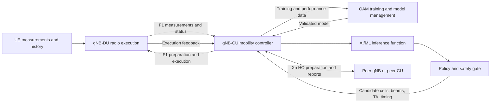
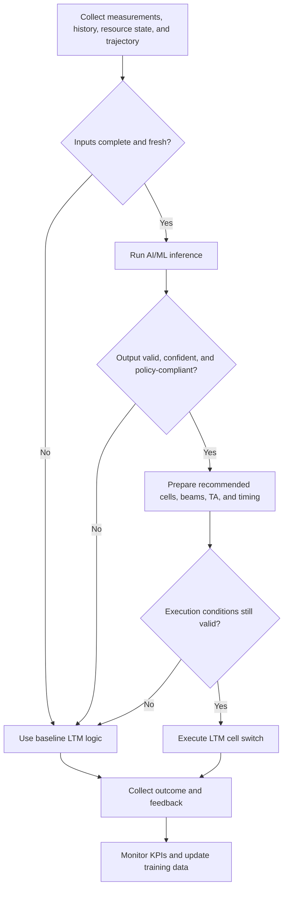
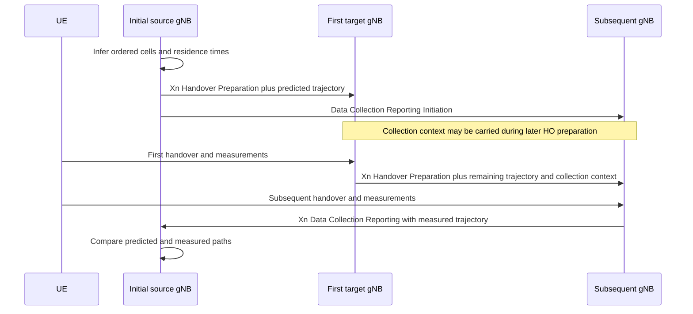
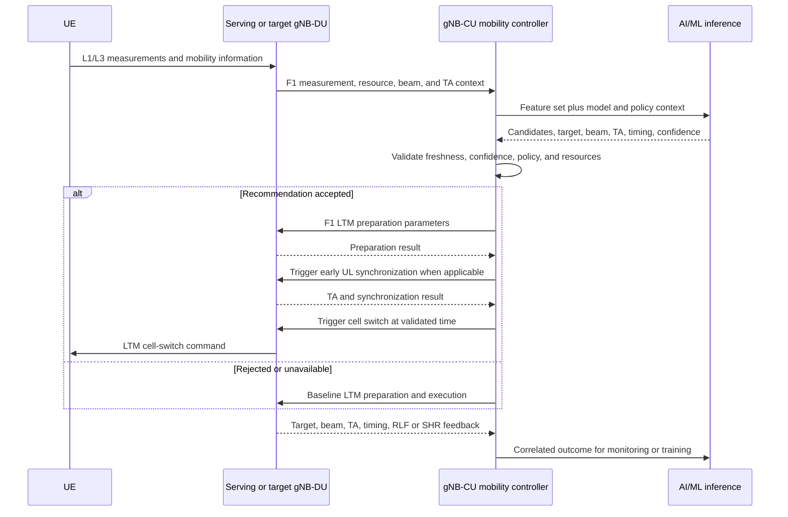
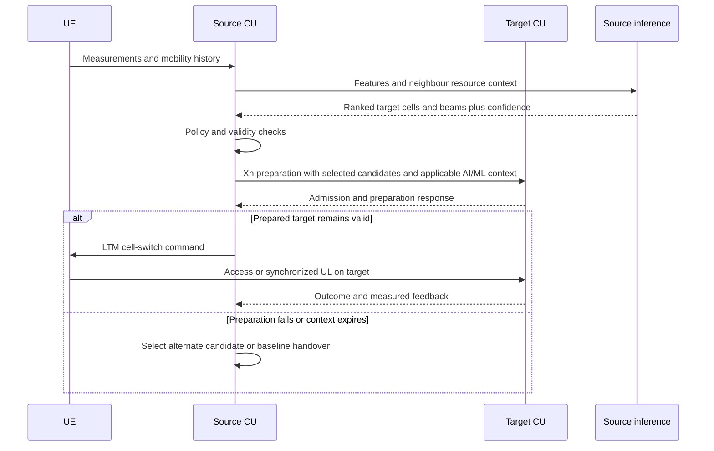
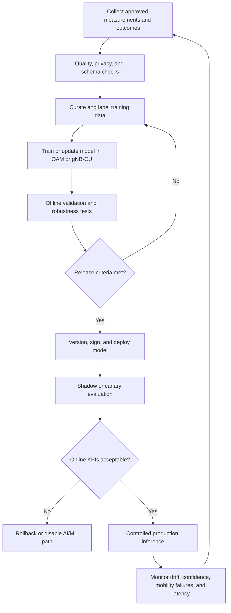

# AI/ML-Assisted Mobility Design for NG-RAN

**Source baseline:** 3GPP TR 38.745 V20.0.0 (Release 20, March 2026)

**Status:** Engineering interpretation of a study report. The source recommends normative work; exact protocol procedures, information elements, timers, fallback rules, and model-management requirements remain subject to specification.

## Document Purpose

This Markdown document consolidates every substantive section of TR 38.745 and translates the study findings into an implementable design flow for multi-hop UE trajectory, AI/ML-assisted intra-CU L1/L2 Triggered Mobility (LTM), and AI/ML-assisted inter-CU LTM.

## Table of Contents

1. Scope
2. References
3. Terms, Symbols, and Abbreviations
4. System Context and Design Principles
5. Multi-hop UE Trajectory
6. AI/ML-Assisted Intra-CU LTM
7. AI/ML-Assisted Inter-CU LTM
8. End-to-End AI/ML Lifecycle
9. Interface and Data Design
10. Resilience, Security, and Observability
11. Verification and Validation
12. Normative Work Items and Implementation Checklist
13. Conclusion
14. Annex A — Change History
## 1. Scope

The source studies three Release 20 AI/ML mobility use cases:

- Multi-hop UE trajectory prediction and collection.
- AI/ML-assisted intra-CU LTM using L3 and L1 measurements with inference in the gNB-CU.
- AI/ML-assisted inter-CU LTM, including candidate-cell selection and Xn-related impacts.

This design preserves existing LTM control procedures and introduces AI/ML as an advisory optimization function. Deterministic policy, protocol validation, admission control, and fallback logic remain authoritative.

## 2. References

1. 3GPP TR 21.905, *Vocabulary for 3GPP Specifications*.
2. 3GPP TS 38.300, *NR; NR and NG-RAN Overall Description*.
3. 3GPP TS 38.401, *NG-RAN; Architecture Description*.

References are specific or non-specific as defined by 3GPP drafting practice. A non-specific 3GPP reference resolves to the latest version in the same Release as this design baseline.

## 3. Terms, Symbols, and Abbreviations

The source adds no formal terms or symbols. The following working abbreviations are used:

| Abbreviation | Meaning |
|---|---|
| AI/ML | Artificial Intelligence / Machine Learning |
| CU | Central Unit |
| DU | Distributed Unit |
| gNB | Next Generation NodeB |
| HO | Handover |
| LTM | L1/L2 Triggered Mobility |
| OAM | Operations, Administration, and Maintenance |
| RLF | Radio Link Failure |
| RSRP | Reference Signal Received Power |
| RSRQ | Reference Signal Received Quality |
| SHR | Successful Handover Report |
| SINR | Signal-to-Interference-plus-Noise Ratio |
| SON | Self-Organizing Network |
| SSB | Synchronization Signal Block |
| TA | Timing Advance |
| UE | User Equipment |
| UL | Uplink |
| Xn | Interface between NG-RAN nodes |
## 4. System Context and Design Principles

### 4.1 Functional Architecture

### 4.2 Design Principles

1. **Advisory intelligence:** AI/ML recommendations do not bypass standardized mobility checks.
2. **Safe fallback:** invalid, stale, low-confidence, or unavailable inference falls back to conventional LTM logic.
3. **Freshness-bound inputs:** every measurement, trajectory, resource state, model output, and TA value carries time context and validity.
4. **Interface minimization:** transfer only information required for the selected use case over F1 or Xn.
5. **Closed-loop learning:** outcomes are correlated with the model version and inference decision that influenced them.
6. **Interoperability:** unsupported AI/ML information must not prevent baseline mobility procedures.
7. **Traceability:** model, input snapshot, decision, policy override, execution, and outcome are auditable.

### 4.3 High-Level Decision Flow

## 5. Multi-hop UE Trajectory

### 5.1 Use Case

Release 18 cell-based trajectory information is limited to the first-hop target NG-RAN node. Release 20 study work extends this concept across gNBs. A predicted trajectory is an ordered list of cells the UE is expected to visit, with expected residence time. A measured trajectory is the ordered list of cells actually visited.

### 5.2 Training and Inference Placement

Supported deployment options are:

- Training in OAM; inference in the gNB.
- Training and inference in the gNB.
- For CU-DU split: training in OAM; inference in the gNB-CU.
- For CU-DU split: training and inference in the gNB-CU.

### 5.3 Inputs

From the UE:

- Serving- and neighbour-cell measurements such as RSRP, RSRQ, and SINR.
- Mobility History Information.

From neighbouring RAN nodes:

- UE History Information.

From the local node:

- Previously measured multi-hop UE trajectory.

### 5.4 Output and Feedback

Output:

- Ordered predicted cells across gNBs.
- Expected UE residence time per predicted cell.

Feedback:

- Measured trajectory collected at every visited gNB.

### 5.5 Xn Design Impact

The initial source gNB includes the predicted multi-hop trajectory in Handover Preparation toward a target gNB. Information supporting trajectory collection is propagated to subsequent gNBs. The initial source starts Data Collection Reporting with subsequent gNBs, and each visited gNB returns measured trajectory data over Xn.

### 5.6 Processing Rules

1. Assign a trajectory identifier and creation time.
2. Bind predictions to UE context without exposing unnecessary identity information.
3. Maintain chronological cell order and optional dwell-time confidence.
4. Remove expired hops before forwarding.
5. Detect loops, invalid cells, topology conflicts, and stale predictions.
6. Correlate measured hops with the original prediction for model evaluation.
7. Continue normal handover when trajectory information is absent or rejected.
## 6. AI/ML-Assisted Intra-CU LTM

### 6.1 Use Case

LTM is defined in TS 38.300 and intra-CU LTM in TS 38.401. AI/ML is studied to improve UE and network performance, optimize resource allocation, and reduce mobility failures. The studied design uses L3 and L1 measurements with inference in the gNB-CU.

### 6.2 Training and Inference Placement

- Training in OAM and inference in the gNB-CU; or
- Training and inference in the gNB-CU.

### 6.3 Inputs

Local-node inputs:

- L3 measurement results.
- UE history information.
- Measured or predicted radio-resource status per cell or SSB area.
- Measured or predicted cell-based UE trajectory.
- Historical candidate LTM cell and beam lists.
- Measured TA values.

UE-originated inputs:

- UE measurement reports.
- Mobility history information.

### 6.4 Outputs

- Candidate cells and beams for LTM HO preparation.
- Target cells and beams for the cell-switch command.
- Cells and beams for early UL synchronization.
- TA values for early UL synchronization.
- Cell-switch trigger timing for L3-measurement-based LTM.
- Early-UL-synchronization trigger timing for L3-measurement-based LTM.
- Best beam of the first cell in the predicted cell-based trajectory.
- TA validity time.

**Open normative point:** applicability of predicted TA validity time to measured and/or predicted TA remains to be assessed.

### 6.5 Feedback

- Actual LTM target cell and beam.
- Measured TA values.
- SON reports, including RLF and SHR where applicable.
- Cell-switch execution time.
- Early-UL-synchronization time.

### 6.6 Intra-CU Preparation and Execution Flow

### 6.7 F1 Impact

F1 is expected to support applicable transfer of the inputs, outputs, and feedback listed above. A normative design should define capability negotiation, identifiers, timestamps, confidence, validity, failure causes, and compatibility behavior for each information item.
## 7. AI/ML-Assisted Inter-CU LTM

### 7.1 Use Case

Inter-CU LTM is defined in TS 38.300. AI/ML may optimize the procedure, particularly candidate-cell selection.

### 7.2 Design Baseline

The intra-CU inputs, outputs, feedback, validation, and fallback principles should be reused where applicable. Information that crosses CU or gNB boundaries requires corresponding Xn support.

### 7.3 Inter-CU Controls

- Negotiate support before sending optional AI/ML information.
- Limit disclosed UE history and model-derived context.
- Validate target topology, capacity, beam availability, and timing independently.
- Define handling for partial candidate-list acceptance.
- Prevent source and target decisions from using incompatible validity assumptions.
- Correlate Xn feedback with the initiating inference and model version.

## 8. End-to-End AI/ML Lifecycle

### 8.1 Model-Governance Requirements

- Immutable model identifier and version.
- Documented feature schema and preprocessing version.
- Compatibility declaration for software and interface versions.
- Signed artifact and controlled deployment authorization.
- Performance thresholds by mobility scenario.
- Drift, bias, calibration, and confidence monitoring.
- Rollback to the last accepted model.
- Retention policy for training and inference records.
## 9. Interface and Data Design

### 9.1 Common Information Model

| Field | Purpose |
|---|---|
| UE context reference | Correlates mobility information without unnecessary identity exposure |
| Decision or trajectory ID | Correlates preparation, execution, and feedback |
| Model ID and version | Makes decisions reproducible |
| Generation timestamp | Supports freshness validation |
| Validity duration | Prevents stale use |
| Source node and scope | Defines ownership and applicability |
| Candidate cells and beams | Carries ranked preparation choices |
| Confidence or score | Supports policy gating |
| Expected dwell time | Qualifies trajectory hops |
| TA value and source | Distinguishes measured from predicted TA |
| TA validity time | Bounds early synchronization use |
| Trigger-time recommendation | Supports cell switch or early UL synchronization |
| Outcome and cause | Supports monitoring and learning |

### 9.2 F1 Requirements

- CU-DU capability negotiation.
- Transfer of measurements, resource state, candidate lists, beam data, TA data, timing recommendations, and feedback where applicable.
- Clear request, response, rejection, partial-acceptance, and timeout behavior.
- Ordering and correlation across preparation and execution messages.

### 9.3 Xn Requirements

- Transfer predicted multi-hop trajectories during Handover Preparation.
- Initiate and deliver measured-trajectory reporting.
- Support applicable inter-CU LTM candidate and feedback information.
- Preserve backward compatibility when a peer does not support extensions.

## 10. Resilience, Security, and Observability

### 10.1 Failure and Fallback Rules

- Missing inputs: use baseline LTM.
- Inference timeout: do not delay the mobility deadline.
- Low confidence: reject or restrict the recommendation.
- Stale trajectory or TA: discard and reacquire.
- Target preparation failure: try a validated alternate or baseline procedure.
- Model or schema mismatch: disable the AI/ML path for the affected context.
- KPI degradation or drift: enter shadow mode or roll back.

### 10.2 Security and Privacy

- Authenticate and protect OAM, F1, and Xn exchanges according to applicable specifications.
- Apply least privilege to model deployment and data access.
- Minimize retained UE history and trajectory data.
- Protect model artifacts, feature pipelines, and inference logs from tampering.
- Detect anomalous measurements, poisoned feedback, and implausible predictions.

### 10.3 Operational Metrics

- LTM preparation success rate.
- Cell-switch success and interruption time.
- RLF and handover-failure rates.
- Early UL synchronization success and latency.
- Candidate-list precision and target acceptance.
- Predicted-versus-measured trajectory accuracy.
- TA prediction error and expiry rate.
- Inference latency, timeout rate, and fallback rate.
- Model confidence calibration and drift indicators.
## 11. Verification and Validation

### 11.1 Test Matrix

| Area | Minimum verification |
|---|---|
| Functional | Candidate ranking, target selection, beam selection, TA prediction, trigger timing |
| Interfaces | F1 and Xn capability negotiation, encoding, rejection, timeout, and backward compatibility |
| Mobility | Stationary, pedestrian, vehicular, dense urban, edge, and rapid topology-change cases |
| Robustness | Missing, delayed, contradictory, noisy, and adversarial inputs |
| Performance | Inference deadline, control-plane latency, scale, CPU, memory, and signaling load |
| Safety | Policy override, stale-output rejection, rollback, and baseline fallback |
| Learning | Prediction/outcome correlation, model drift, retraining, and version traceability |
| Security | Authorization, integrity, confidentiality, audit, and data-retention controls |

### 11.2 Acceptance Gates

1. No regression against baseline LTM under unsupported or failed AI/ML conditions.
2. AI/ML inference completes within the configured mobility decision budget.
3. F1 and Xn extensions interoperate with peers that ignore optional information.
4. Safety and policy gates reject invalid cells, beams, TA, and timing.
5. Target KPIs improve without unacceptable degradation in tail cases.
6. Every AI-influenced decision is traceable to inputs, policy, and model version.

## 12. Normative Work Items and Implementation Checklist

### 12.1 Normative Gaps

- Exact F1 and Xn procedures and information elements.
- Capability and feature negotiation.
- Candidate ranking semantics and confidence representation.
- Time reference, validity, expiry, and synchronization rules.
- Applicability of predicted TA validity to measured and predicted TA.
- Failure causes, partial acceptance, retries, and fallback.
- Data collection initiation, termination, correlation, and retention.
- Model lifecycle, deployment, monitoring, and rollback requirements.
- Security, privacy, charging, and operational impacts where applicable.

### 12.2 Implementation Checklist

- [ ] Select training and inference placement.
- [ ] Define feature ownership and freshness limits.
- [ ] Define F1 input, output, and feedback mappings.
- [ ] Define Xn trajectory and inter-CU mappings.
- [ ] Implement policy, confidence, and validity gates.
- [ ] Implement deterministic fallback.
- [ ] Add model and decision correlation identifiers.
- [ ] Add telemetry for mobility outcomes and inference behavior.
- [ ] Validate privacy and retention controls.
- [ ] Complete interoperability, robustness, and performance tests.
- [ ] Establish canary deployment and rollback.
- [ ] Document operational ownership and incident response.

## 13. Conclusion

RAN3 recommends multi-hop UE trajectory, AI/ML-assisted intra-CU LTM, and AI/ML-assisted inter-CU LTM for Release 20 normative work. The practical impact is an AI/ML decision layer in or managed by the gNB-CU, new or extended F1 transfer for intra-CU data, Xn transfer for multi-hop trajectory and inter-CU support, earlier UL synchronization, improved candidate and beam selection, and closed-loop feedback. Production design must preserve baseline mobility, enforce freshness and policy constraints, and provide complete observability and rollback.

## 14. Annex A — Change History

| Date | Meeting | TDoc | Subject / Comment | New version |
|---|---|---|---|---|
| 2025-10 | RAN3#129-bis | R3-256546 | Skeleton for TR 38.745 | 0.0.0 |
| 2025-10 | RAN3#129-bis | R3-257331 | Included agreed text proposals R3-257329 and R3-257031 | 0.0.1 |
| 2025-10 | RAN3#129-bis | R3-257331 | Version update | 0.1.0 |
| 2025-11 | RAN3#130 | R3-258086 | Submitted for endorsement | 0.1.1 |
| 2025-11 | RAN3#130 | R3-258878 | Included agreed proposals R3-258864, R3-258865, and R3-258866 | 0.2.0 |
| 2025-12 | RAN#110 | RP-253139 | Submitted for approval | 1.0.0 |
| 2026-02 | RAN3#131 | R3-260027 | Submitted for endorsement | 1.1.0 |
| 2026-02 | RAN3#131 | R3-260821 | Included agreed proposals R3-260670, R3-260724, R3-260806, and R3-260807 | 1.2.0 |
| 2026-03 | RAN#111 | RP-260263 | Submitted for approval | 2.0.0 |
| 2026-03 | RAN#111 | — | Approved by RAN plenary | 20.0.0 |

