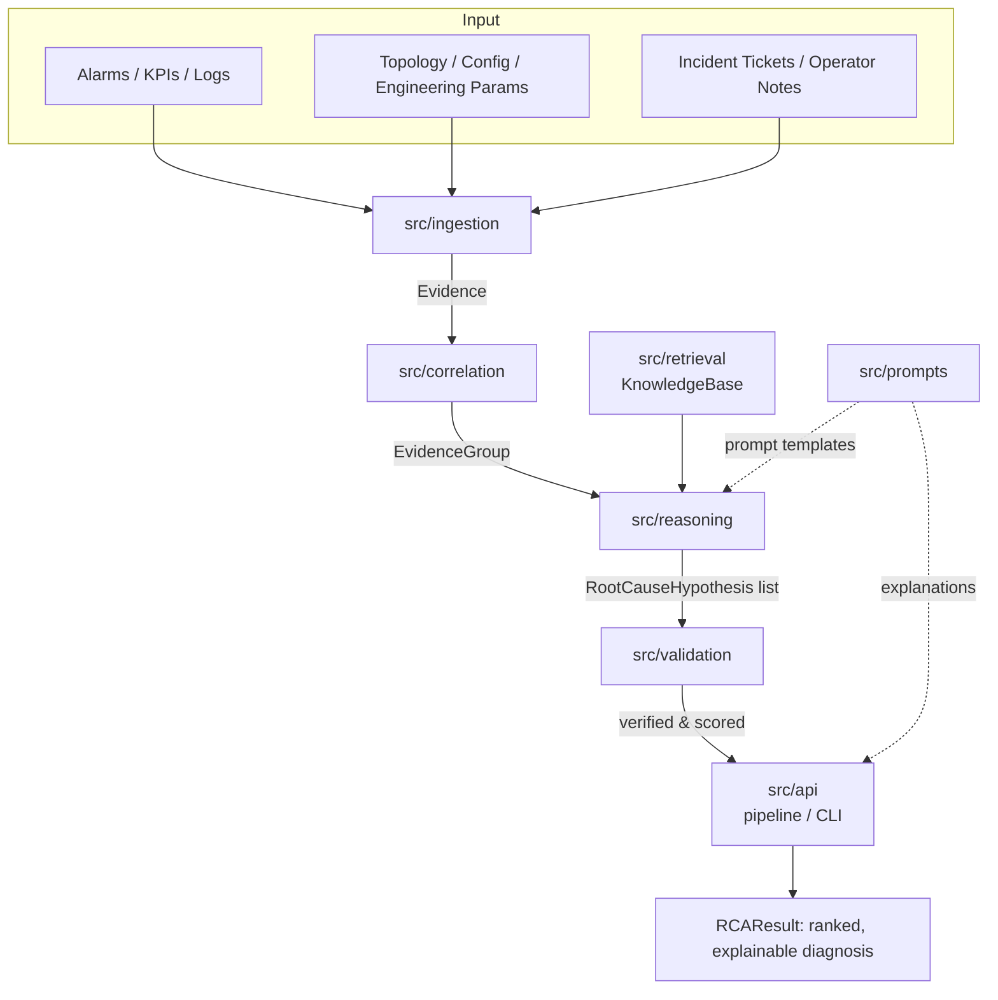

# Architecture

This document describes the module-level architecture of the reference
implementation in this repository, which realizes the design proposed in
[`AI-ML-or-LLM-RCA.md`](../AI-ML-or-LLM-RCA.md) (itself based on the attached
paper, *"Large Language Models (LLMs) for Telecom Root Cause Analysis (RCA):
A Structured Reasoning Framework for Evidence-Grounded Diagnosis"*).

## Design Principle

LLMs are useful for telecom RCA **only when embedded in a structured,
evidence-grounded reasoning framework**. This repository therefore does not
implement a single prompt-and-respond chatbot; it implements a pipeline of
small, composable stages, each with a narrow responsibility, so that
evidence can be traced end-to-end from raw telemetry to a ranked, verified,
and explainable root-cause decision.

## Module Map

### `src/common`

Shared data models used by every other module:

- `Evidence` — a single normalized piece of telemetry (alarm, KPI, log,
  topology/config fact, engineering parameter, or ticket), tagged with an
  `EvidenceType` and an `EvidenceLayer` (physical, MAC/RLC, RRC, transport,
  core, configuration, service).
- `EvidenceGroup` — a time-windowed, entity-scoped collection of evidence
  produced by correlation.
- `RootCauseHypothesis` — a candidate root cause with a score, supporting
  and contradicting evidence, diagnostic `checks`, and a `verified` flag.
- `RCAResult` — the final ranked list of hypotheses for an incident, with an
  `explain()` method producing a human-readable, auditable report.

### `src/ingestion`

Normalizes heterogeneous raw records (dicts from alarms, KPI feeds, logs,
topology/config dumps, tickets, engineering parameters) into `Evidence`
objects with a consistent schema. This is the "Input Layer" from the
design document (Section 7.1): it deliberately tolerates missing/partial
fields by skipping unparsable records rather than failing the whole batch.

### `src/correlation`

Groups `Evidence` by network entity and time window (`correlate_by_entity`),
merges related groups (`merge_groups`, e.g. serving + neighbor cells), and
can identify cross-layer evidence groups (`find_cross_layer_groups`) — the
multi-layer correlation emphasized throughout the design document
(Section 7.2) as the key differentiator from isolated symptom analysis.

### `src/retrieval`

A minimal `KnowledgeBase` with keyword- and tag-based search over a small
seed set of domain-knowledge documents (coverage/downtilt, mobility/
handover, scheduling, interference, transport). This stands in for the
retrieval-augmented-generation (RAG) grounding described in Section 3.2,
giving the reasoning engine concrete, citable supporting text for each
hypothesis rather than an unsupported LLM assertion.

### `src/prompts`

Prompt templates that render an `EvidenceGroup` into the canonical,
structured-context format described in Section 4.1 (Bottleneck Snapshot /
UE Global State / Trajectory-Level Events style blocks), plus helpers to
turn a `RootCauseHypothesis` into an explainable narrative. These templates
are what you would send to an actual LLM API in a full deployment; the
rest of the pipeline works identically whether the "reasoning" step is a
rule engine (as implemented here) or a real LLM call.

### `src/reasoning`

The `ReasoningEngine`:

1. Runs a small set of deterministic **diagnostic checks** over an
   `EvidenceGroup` (`run_diagnostic_checks`) — e.g. `speed_check`,
   `low_rb_check`, `handover_check`, `distance_check`, `downtilt_check`,
   `interference_check`, `transport_check` — directly mirroring the
   SEKA-FT decision-path-control checks from Section 4.2.
2. Generates one `RootCauseHypothesis` per positive check
   (`generate_hypotheses`), grounding each in supporting knowledge-base
   documents, with a safe fallback "undetermined cause" hypothesis when no
   check fires.
3. Ranks hypotheses by score and supporting-evidence count (`rank`).

### `src/validation`

`verify_hypothesis` / `verify_hypotheses` implement evidence-grounded
verification (Section 7.5): a hypothesis is only marked `verified` if its
backing check actually fired, there is evidence for its declared layer, and
its score survives an ambiguity penalty applied when multiple checks fire
simultaneously (reflecting the paper's observation that overlapping
RSRP/SINR/neighbor-cell patterns can produce ambiguous cases).

### `src/api`

`run_pipeline(...)` wires ingestion → correlation → reasoning → validation
into a single call, returning an `RCAResult`. `main(...)` exposes this as a
CLI (see `scripts/run_pipeline.sh`) that reads a JSON evidence file and
prints a ranked, explainable diagnosis.

## Human-in-the-Loop

Nothing in this pipeline takes autonomous remediation action. The final
`RCAResult.explain()` output is designed to be reviewed by a network
operator, who confirms or corrects the diagnosis before any remediation —
consistent with Section 7.7 of the design document.
