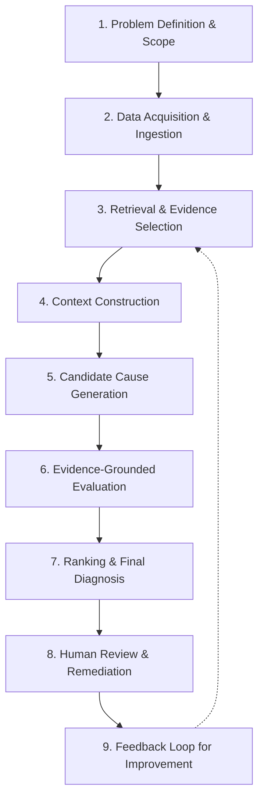

# RCA Workflow

This document describes the runtime, end-to-end workflow implemented by
`src/api/cli.py:run_pipeline`, following the nine-stage workflow described in
Section 8 of [`AI-ML-or-LLM-RCA.md`](../AI-ML-or-LLM-RCA.md).

## Workflow Stages



| Stage | Description | Implementation |
|---|---|---|
| 1. Problem Definition & Scope | Define the symptom, affected entity/region, and time window of the incident. | Caller supplies `incident_id` and a scoped set of `raw_records` to `run_pipeline`. |
| 2. Data Acquisition & Ingestion | Collect raw telemetry (alarms, KPIs, logs, config, tickets) and normalize into `Evidence`. | `src/ingestion/normalizer.py: normalize_records` |
| 3. Retrieval & Evidence Selection | Retrieve relevant domain knowledge / historical patterns for grounding. | `src/retrieval/retriever.py: KnowledgeBase.search` / `search_by_tag` |
| 4. Context Construction | Correlate evidence by entity/time window into a structured context. | `src/correlation/correlator.py: correlate_by_entity`, `merge_groups` |
| 5. Candidate Cause Generation | Run diagnostic checks and generate multiple candidate root causes. | `src/reasoning/engine.py: ReasoningEngine.generate_hypotheses` |
| 6. Evidence-Grounded Evaluation | Validate each candidate against the evidence; penalize ambiguity/missing-layer evidence. | `src/validation/validator.py: verify_hypotheses` |
| 7. Ranking & Final Diagnosis | Rank candidates by score and supporting evidence; build the final result. | `src/reasoning/engine.py: ReasoningEngine.rank`, `src/common/models.py: RCAResult` |
| 8. Human Review & Remediation | A network operator reviews `RCAResult.explain()` and decides on remediation. | `src/api/cli.py: main` (prints explainable output); human-in-the-loop, out of scope for automation. |
| 9. Feedback Loop for Improvement | Confirmed/corrected diagnoses feed back into the knowledge base / thresholds / future fine-tuning data. | `src/retrieval/retriever.py: KnowledgeBase.add` (extend with new documents); thresholds in `src/reasoning/engine.py: DiagnosticThresholds` can be tuned from feedback. |

## Running the Workflow

```bash
# From the repository root
pip install -r requirements.txt
./scripts/run_pipeline.sh path/to/evidence.json
```

Or programmatically:

```python
from src.api.cli import run_pipeline

records = [
    {
        "source": "drive_test",
        "entity_id": "cell-0",
        "timestamp": "2026-01-01T00:00:00",
        "type": "engineering_parameter",
        "layer": "physical",
        "mechanical_downtilt_deg": 30,
    },
    # ... additional KPI / mobility / handover records ...
]

result = run_pipeline(records, incident_id="incident-123")
print(result.explain())
```

See `tests/test_pipeline.py` for a complete worked example reproducing the
paper's illustrative "downtilt causes edge coverage loss" case.
